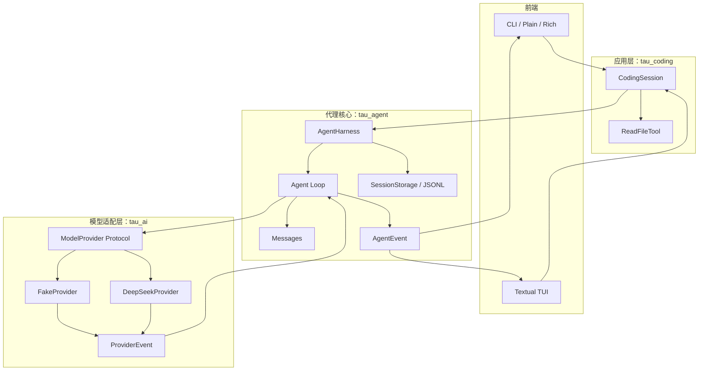

# Tau：用 Python 重写一个 Coding Agent Harness

Tau 是一个用于学习和实践的项目：参考 Pi 的 Coding Agent Harness 架构，用 Python 逐步重建一个可运行的编码代理。重点是理解模型适配、Agent Loop、工具调用、事件传递和会话持久化之间的边界，而不是一次性堆出所有功能。

> 当前仓库是循序开发中的学习版本，已有最小可运行闭环和 JSONL message 持久化；它还不是 Pi 的完整功能复刻。

## 当前能力

- 统一的 `ModelProvider` 接口，以及 Fake 和 DeepSeek Provider。
- 流式 Provider 事件、Agent Loop 和工具调用循环。
- `AgentHarness`：管理一段会话的消息历史、运行状态、取消和事件订阅。
- `CodingSession`：把 Harness、项目目录和当前的只读文件工具组合成应用会话。
- CLI：支持一次性提问、交互模式和 Plain/Rich 输出。
- Textual TUI：作为 AgentEvent 的消费者显示对话和工具状态。
- 可选的 JSONL 会话存储：追加消息、恢复历史，并通过 `parent_id` 表示会话分支关系。

当前 CodingSession 提供的是只读 `read` 工具。写文件和 Shell 工具尚未加入；在继续扩展前，需要先学习并设计沙箱与路径安全边界。

## 架构



依赖和职责方向：

- `tau_ai` 把不同模型厂商的请求与响应适配成统一的 Provider 接口和增量事件。
- `tau_agent` 不依赖 CLI 或 TUI；它负责消息、工具循环、AgentEvent、Harness 和会话存储。
- `tau_coding` 负责把 Provider、工具、项目目录和 Harness 组装为可运行应用。
- CLI 与 TUI 消费 AgentEvent，不在界面层实现模型调用或工具循环。

## 环境要求

- Python 3.12 或更高版本
- [uv](https://docs.astral.sh/uv/)

在项目根目录安装并同步依赖：

```bash
uv sync
```

项目采用 `src/` 布局。开发时运行源码命令需设置 `PYTHONPATH=src`。

## 运行

### Fake Provider：无需 API Key

单次运行：

```bash
PYTHONPATH=src uv run python -m tau_coding.cli \
  --provider fake \
  --renderer plain \
  "你好"
```

交互模式：

```bash
PYTHONPATH=src uv run python -m tau_coding.cli \
  --provider fake \
  --interactive
```

输入 `/exit` 或 `/quit` 退出。

### DeepSeek Provider

先在项目根目录的 `.env` 文件中设置密钥；`.env` 已加入 Git 忽略规则，不要把真实密钥提交到仓库：

```dotenv
DEEPSEEK_API_KEY=你的密钥
```

调用示例：

```bash
PYTHONPATH=src uv run --env-file .env python -m tau_coding.cli \
  --provider deepseek \
  --model deepseek-chat \
  "只回复：连接成功"
```

也可以通过当前 shell 的环境变量提供 `DEEPSEEK_API_KEY`。不要把密钥写入源码、README、命令历史或提交记录。

### 持久化会话

通过 `--session-file` 指定 JSONL 文件；再次使用同一路径时会恢复此前消息：

```bash
PYTHONPATH=src uv run python -m tau_coding.cli \
  --provider fake \
  --session-file .tau-session.jsonl \
  "你好"
```

也可以在交互模式或 TUI 中使用该参数。会话文件可能包含对话内容，按个人数据妥善保管；不要把真实会话文件提交到公开仓库。

### Textual TUI

```bash
PYTHONPATH=src uv run python -m tau_coding.tui \
  --provider fake
```

指定项目目录和持久化文件：

```bash
PYTHONPATH=src uv run python -m tau_coding.tui \
  --project . \
  --provider fake \
  --session-file .tau-session.jsonl
```

## 项目结构

```text
src/
├── tau_ai/                 # Provider 适配与模型事件
├── tau_agent/              # 消息、Agent Loop、Harness、工具和会话存储
│   └── session/            # JSONL、消息 entry、恢复与内存存储
└── tau_coding/             # CodingSession、CLI、渲染器和 Textual TUI
    ├── rendering/
    └── tui/

dev-notes/                  # 阶段设计与实现记录
examples/                   # 可直接运行的契约和行为检查脚本
```

## 运行检查

检查脚本位于 `examples/`，可以逐个运行：

```bash
PYTHONPATH=src uv run python examples/check_session_persistence.py
```

运行全部检查脚本：

```bash
for check in examples/check_*.py; do
  PYTHONPATH=src uv run python "$check" || exit 1
done
```

这些脚本覆盖消息类型、Provider 事件、工具循环、取消、Harness、会话持久化、CLI 渲染和 TUI 行为。它们是可执行检查脚本，不是 pytest 测试套件。

## 学习与开发约定

这个项目按小阶段推进。每次扩展先明确接口的职责和依赖方向，再用 Fake Provider 或 Fake Tool 验证行为，最后再接入真实 Provider 或界面。核心架构原则是：

```text
ProviderEvent -> Agent Loop -> AgentEvent -> Harness -> CodingSession -> CLI / TUI
```

开发笔记记录了当前阶段的设计与边界：

- [`dev-notes/session-persistence.md`](dev-notes/session-persistence.md)：JSONL 持久化与历史恢复
- [`dev-notes/tui-ime.md`](dev-notes/tui-ime.md)：Textual TUI 中文输入布局
